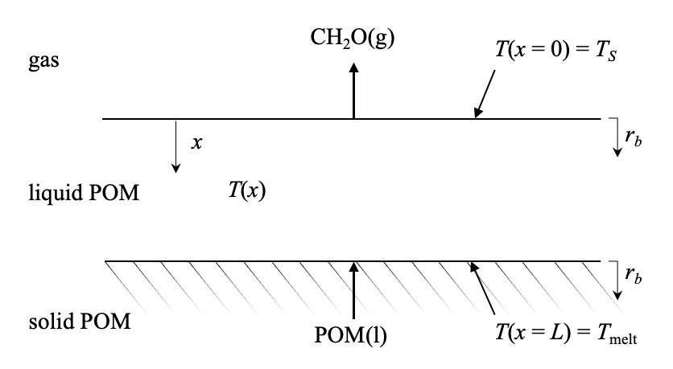

## A One-Dimensional Steady-State Model for Polymer Decomposition into Vapor-Phase Monomer

### Schematic (shown for polyoxymethylene as example)



### Nomenclature

| Symbol | Units | Description |
| :--: |  :--: | :--: |
| $T$ | K | temperature |
| $x$ | m | depth |
| $k$ | W/(m$`\cdot`$K) | liquid-phase (molten-layer) thermal conductivity |
| $\rho$ | kg/m<sup>3</sup> | liquid-phase density |
| ${\rm MW}_0$ | kg/mol | monomer molecular weight |
| ${\rm MW}$ | kg/mol | polymer molecular weight |
| $A_\beta$ | s<sup>-1</sup> | intrinsic pre-exponential factor for $\beta$-scission |
| $E_a$ | J/mol | intrinsic activation energy of beta scission |
| $\gamma$ | | correction factor to the pre-exponential factor |
| $\Delta_rH$ | J/kg | heat of decomposition reaction |
| $\Delta h_{\rm LH}$ | J/kg | latent heat of polymer fusion |
| $R_u$ | J/(mol$`\cdot`$K) | universal gas constant |
| $T_S$ | K | temperature at liquid-gas interface |
| $T_{\rm melt}$ | K | polymer melting point (temperature at solid-liquid interface) |
| $\dot{Q}_0''$ | J/(s$`\cdot`$m<sup>2</sup>) | heat flux at liquid-gas interface |
| $r_b$ | m/s | regression rate of the molten polymer surface |

### Version 0.9

#### Assumptions

- Uniform in $y$, $z$ directions. 1D steady state treatment.
- Decomposition occurs in liquid phase only.
- Regression is due to beta-scission to release monomer.
- Radical initiation reaction is neglected
- Constant $k$, MW, $\rho$, $\gamma$.
  
#### Model

An analytical steady-state model for calculating polymer surface regression rate at a given heat flux or surface temperature.

1) Regression rate for given heat flux:

```math
r_b=\frac{\dot{Q}_0''}{\rho(\Delta h_{\rm LH}+\frac{\Delta_rH}{{\rm MW}_0})}.
```

2) Regression rate for given surface temperature:

```math
r_b=\frac{kE_a}{\Delta h_{\rm LH}\rho R_u}\sqrt{\frac{2\tilde{A}[g(\tilde{\theta}_S)-g(\tilde{\theta}_{\rm melt})]}{(1+\tilde{h})^2-1}},
```

where

```math
\begin{gathered}
\tilde{A}=\frac{2\Delta_rH\rho A_\beta R_u\gamma}{{\rm MW}kE_a}, \\
\quad \tilde{\theta}_S=\frac{R_uT_S}{E_a},\\
\quad \tilde{\theta}_{\rm melt}=\frac{R_uT_{\rm melt}}{E_a},\\
\quad \tilde{h}=\frac{\Delta_rH}{{\rm MW}_0\Delta h_{\rm LH}}, \\
g(u)={\rm Ei}\left(-\frac{1}{u}\right)+u\exp\left(-\frac{1}{u}\right),\\
\quad {\rm Ei}(u)=\int_{-\infty}^u\frac{\exp(t)}{t}{\rm d}t.
\end{gathered}
```

##### Sample parameter values for Polyoxymethylene (POM)

- Decomposition product: formaldehyde (CH$`_2`$O)
- $k$ = 0.14 W/m$`\cdot`$K [^1]
- $\rho$ = 1.2 g/cm<sup>3</sup> [^2]
- ${\rm MW}_0$ = 30 g/mol
- ${\rm MW}$ = 1$`\times 10^5`$ g/mol [^3]
- $A_\beta$ = 1.8$`\times 10^{13}`$ s<sup>-1</sup> [^4]
- $E_a$ = 30 kcal/mol [^5]
- $\Delta_rH$ = 56 kJ/mol [^6]
- $\Delta h_{\rm LH}$ = 150 J/g [^7]
- $T_{\rm melt}$ = 438 K [^8][^9]
- $\gamma$ = 1
- $R_u$ = 8.314 J/mol$`\cdot`$K

##### Sample regression rate values
Input: Liquid-gas interface temperature $T_S$:
| $T_S$ (K) | $r_b$ (m/s) |
| :--: |  :--: | 
| 800 | 5.34$`\times 10^{-4}`$ |
| 700 | 1.22$`\times 10^{-4}`$ |
| 600 | 1.75$`\times 10^{-5}`$ |

Input: Liquid-gas interface heat flux $\dot{Q}_0''$:
| $\dot{Q}_0''$ (J/(s$`\cdot`$m<sup>2</sup>)) | $r_b$ (m/s) |
| :--: |  :--: |
| 3$`\times 10^5`$ | 4.13$`\times 10^{-5}`$ |
| 2$`\times 10^5`$ | 8.26$`\times 10^{-5}`$ |
| 1$`\times 10^5`$ | 1.24$`\times 10^{-4}`$ |

#### Gas phase kinetics model

In "mechanism" folder: 13 species, 47 reactions. FFCM-2 [^10] formaldehyde sub-model.
- *.inp, *.dat: Chemkin format files
- *.cti, *.yaml: Cantera format files

### Contributors
Wendi Dong, Nikolaos Kateris, Nicholas J. Montes, Amitesh S. Jayaraman, Hai Wang

Mechanical Engineering Department, Stanford University, Stanford, California 94305, United States

### References

[^1]: S. Luftl, P. Visakh, S. Chandran, Polyoxymethylene handbook: structure, properties, applications and their nanocomposites, John Wiley & Sons, 2014.
[^2]: H. W. Starkweather Jr., G. A. Jones, P. Zoller, The pressure-volume-temperature relationship and the heat of fusion of polyoxymethylene, Journal of Polymer Science Part B: Polymer Physics 26 (2) (1988) 257–266.
[^3]: Estimated, ranging from 1x10<sup>4</sup> to 2x10<sup>5</sup> g/mol.
[^4]: L.-S. Tran, J. Pieper, H.-H. Carstensen, H. Zhao, I. Graf, Y. Ju, F. Qi, K. Kohse-Hoinghaus, Experimental and kinetic modeling study of diethylether flames, Proceedings of the Combustion Institute 36 (1) (2017) 1165–1173.
[^5]: G. Berkowicz, T. M. Majka, W.  ̇Zukowski, The pyrolysis and combustion of polyoxymethylene in a fluidised bed with the possibility of incorporating CO<sub>2</sub>, Energy Conversion and Management 214 (2020) 112888.
[^6]: Group additivity calculation using NIST data.
[^7]: D. Czarnecka-Komorowska, T. Sterzynski, Effect of polyhedral oligomeric silsesquioxane on the melting, structure, and mechanical behavior of polyoxymethylene, Polymers 10 (2) (2018) 203.
[^8]: DURACON® POM report. https://www.polyplastics.com/en/support/mold/duracon/pom04c.html#:~:text=The%20melting%20point%20of%20DURACON,cylinder%20temperature%20(front%20section).
[^9]: K. Pielichowska, The influence of molecular weight on the properties of polyacetal/hydroxyapatite nanocomposites. Part 1. Microstructural analysis and phase transition studies, Journal of Polymer Research 19 (2) (2012) 9775.
[^10]: Y. Zhang, W. Dong, L. Vandewalle, R. Xu, G.P. Smith and H. Wang, Foundational Fuel Chemistry Model Version 2.0 (FFCM-2), https://web.stanford.edu/group/haiwanglab/FFCM2, 2023.
